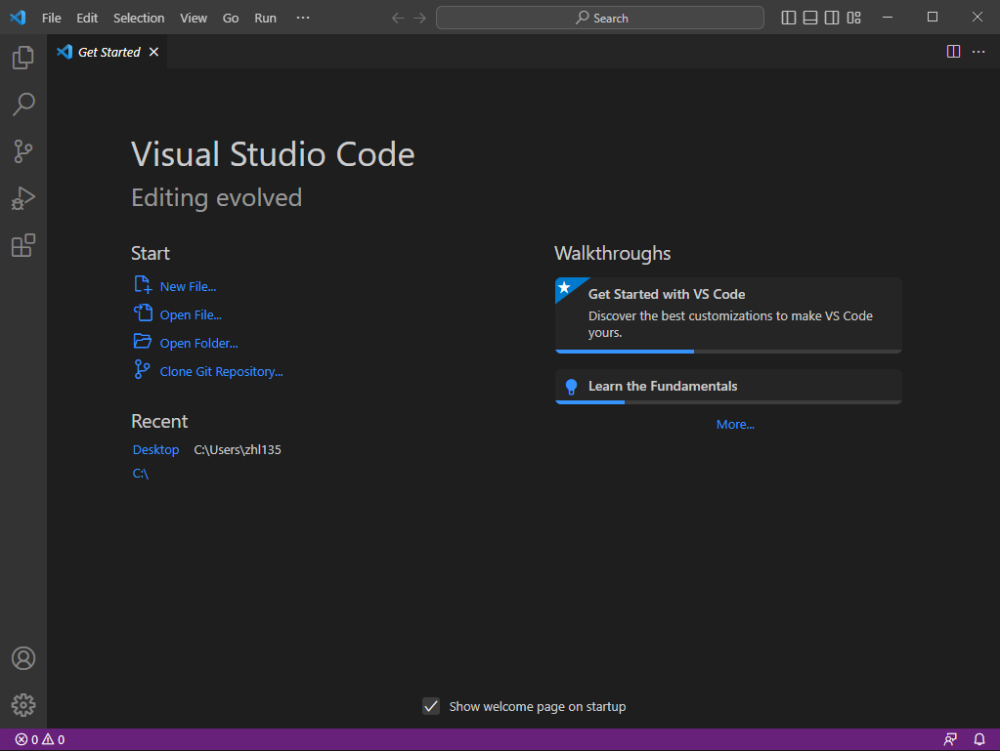
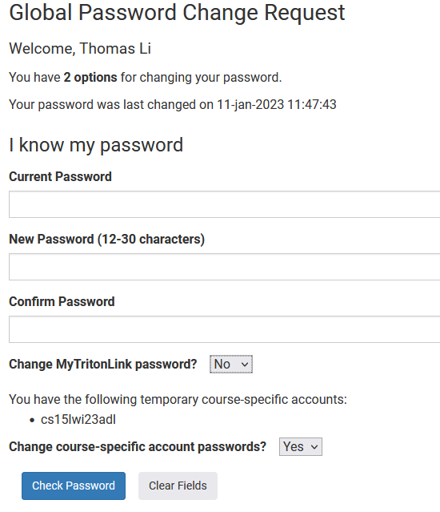
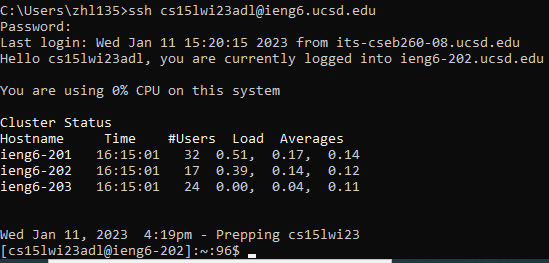
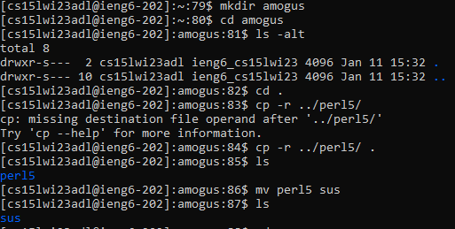

## Week 1 Lab Report -- Remote Access Tutorial

# Installing VScode

Visual Studio Code is pre-installed on the lab computers. On Windows, you can go to [https://code.visualstudio.com/](https://code.visualstudio.com/) to download the installer, and if you're using Linux you should be able to figure it out yourself. We don't talk about Mac OS.

On Windows, just run the installer and follow the instructions. After it's installed, you can launch it and follow the prompts to configure it. After you are done, you should see a page like the following:

# Remotely Connecting

Our goal is to remotely connect to `ieng6` with a course-specific account.

First, we need to get the credentials for our course-specific account. Go to [https://sdacs.ucsd.edu/~icc/index.php](https://sdacs.ucsd.edu/~icc/index.php) and find the username for your account. It should begin with "cse15l". For example, my account is `cs15lwi23adl`. Write this down, you will need it later.

Next, you need to go to [https://sdacs.ucsd.edu/~icc/password.php](https://sdacs.ucsd.edu/~icc/password.php) to set a password for the account. 

After filling in your account details, you should see a similar page as above: fill in your desired passwords, and make sure to set Change course-specific account passwords? to Yes. 

After waiting for a few minutes, you should be able to connect remotely via SSH. Run the command `ssh username@ieng6.ucsd.edu`, where username is the course-specific account username you found earlier. It will prompt you for the password, and after entering the password from the previous step, you should be logged in. 

There should be a similar output to the above image. 

# Trying Some Commands

Now, you can try running some commands on the remote system. Note that the systems have horribly outdated packages, so some behaviour may be unexpected (Ex: GCC version from 2015...). Here are some examples I ran. First, I created a directory called `amogus` with `mkdir amogus`, and then changed into it with `cd amogus`. Then, I queried the files in the directory by running `ls -alt`. Then, I copied the pre-created `perl5` folder from '../perl5' to the current directory `amogus` using `cp -r ../perl5/ .'. Then, I check that it exists in the current directory with `ls` again, and finally, used the `mv` command to rename the `perl5` folder to `sus` (among us reference). 

