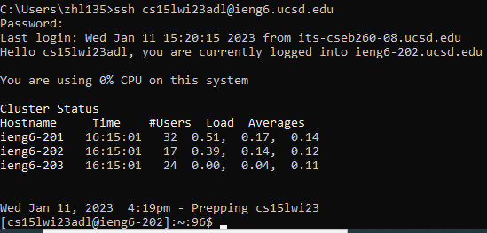

## Week 1 Lab Report -- Remote Access Tutorial

# Installing VScode

Visual Studio Code is pre-installed on the lab computers, but it's easy to install on Arch Linux: Run `sudo pacman -S code`. 

# Remotely Connecting

First, we need to get the credentials for our course-specific account. Go to [https://sdacs.ucsd.edu/~icc/index.php](https://sdacs.ucsd.edu/~icc/index.php) and find the username for your account. It should begin with "cse15l". 

Next, you need to go to [https://sdacs.ucsd.edu/~icc/password.php](https://sdacs.ucsd.edu/~icc/password.php) to set a password for the account. 

# Trying Some Commands

