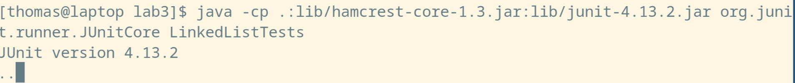

## Lab Report 2 - Servers and Bugs

# String Server

Here is my code for my string server, which supports the specified behaviour from the course site:
```java
import java.io.IOException;
import java.net.URI;

class Handler implements URLHandler {
    String cur;
    Handler(){
        cur = new String();
    }
    public String handleRequest(URI url) {
        if (url.getPath().equals("/add-message")) {
            String[] p = url.getQuery().split("=");  
            if(!p[0].equals("s")){
                return "Invalid Query";
            }
            cur += p[1] + "\n"; 
            return cur;
        } else {
            return "404 Not Found!";
        }
    }
}

class StringServer {
    public static void main(String[] args) throws IOException {
        if(args.length == 0){
            System.out.println("Missing port number! Try any number between 1024 to 49151");
            return;
        }

        int port = Integer.parseInt(args[0]);

        Server.start(port, new Handler());
    }
}
```
I made it by modifying the number server template, so much of the boilerplate code was unchanged. 

Here are some examples of using `/add-message': 


Here, the `handleRequest` method was called by the `Server` class to handle the request. The argument to `handleRequest` was `/add-message?s=sus` -- I queried '/add-message' with `s = sus`. Then, the code called various helper methods to parse the url. For example, it called `getPath` and `equals` with the argument of `/add-message` in order to determine if the path was correct. And it used `.split` with the `=` argument to parse the value for the query. 

In the end, the instance variable `String cur` was appended to with the input string plus a newline character `\n`. Then, `cur` was returned as the result of `handleRequest`, and it was printed to the browser. 


The methods called for this query are the same as the previous one. The only difference is that `cur` contained the value `sus\n` from the previous query, so when it was appended with the current input string, it became `sus\namogus\n`, and hence the output to the browser was: 

```
sus
amogus
```

# Bugs

We can consider `LinkedListExample.java`. A failure inducing input for this is the following:

```java
@Test
public void test2(){
    LinkedList l = new LinkedList();
    l.append(1);
    l.append(3); l.append(4);
    assertEquals(4,l.last());
    assertEquals(1,l.first());
}
```

A non failure inducing input is:

```java
@Test
public void test1(){
    LinkedList l = new LinkedList();
    l.prepend(1);
    l.prepend(2);
    assertEquals(2,l.first());
}
```

When we run the tests above, we get the following output: 


This never terminates on `test2`, but, according to the dots, passes `test1`. 

The bug was in the append method. The original code was:

```java
/**
 * Adds the value to the _end_ of the list
 * @param value
 */
public void append(int value) {
    if(this.root == null) {
        this.root = new Node(value, null);
        return;
    }
    // If it's just one element, add if after that one
    Node n = this.root;
    if(n.next == null) {
        n.next = new Node(value, null);
        return;
    }
    // Otherwise, loop until the end and add at the end with a null
    while(n.next != null) {
        n = n.next;
        n.next = new Node(value, null);
    }
}
```    
We can see that `n.next = new Node(value, null);` is misplaced; it should be after the while loop, not in it. Since it's in the loop, `n.next != null` will always be true, and hence there was an infinite loop in `test2`.

Fixed code: 

```java
/**
 * Adds the value to the _end_ of the list
 * @param value
 */
public void append(int value) {
    if(this.root == null) {
        this.root = new Node(value, null);
        return;
    }
    // If it's just one element, add if after that one
    Node n = this.root;
    if(n.next == null) {
        n.next = new Node(value, null);
        return;
    }
    // Otherwise, loop until the end and add at the end with a null
    while(n.next != null) {
        n = n.next;
    }
    n.next = new Node(value, null);
}
```    
Moving `n.next = new Node(value, null);` after the while loop fixes the bug, as we should add the new node after the last node. The fixed code passes both tests. 


