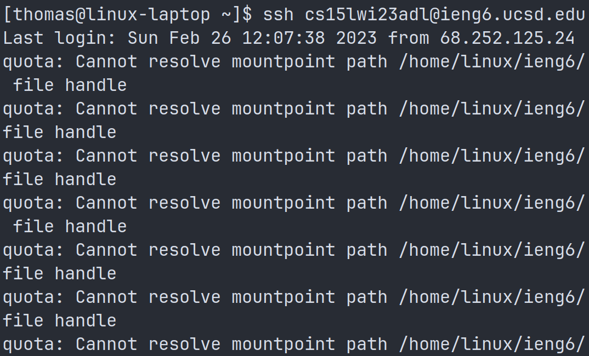
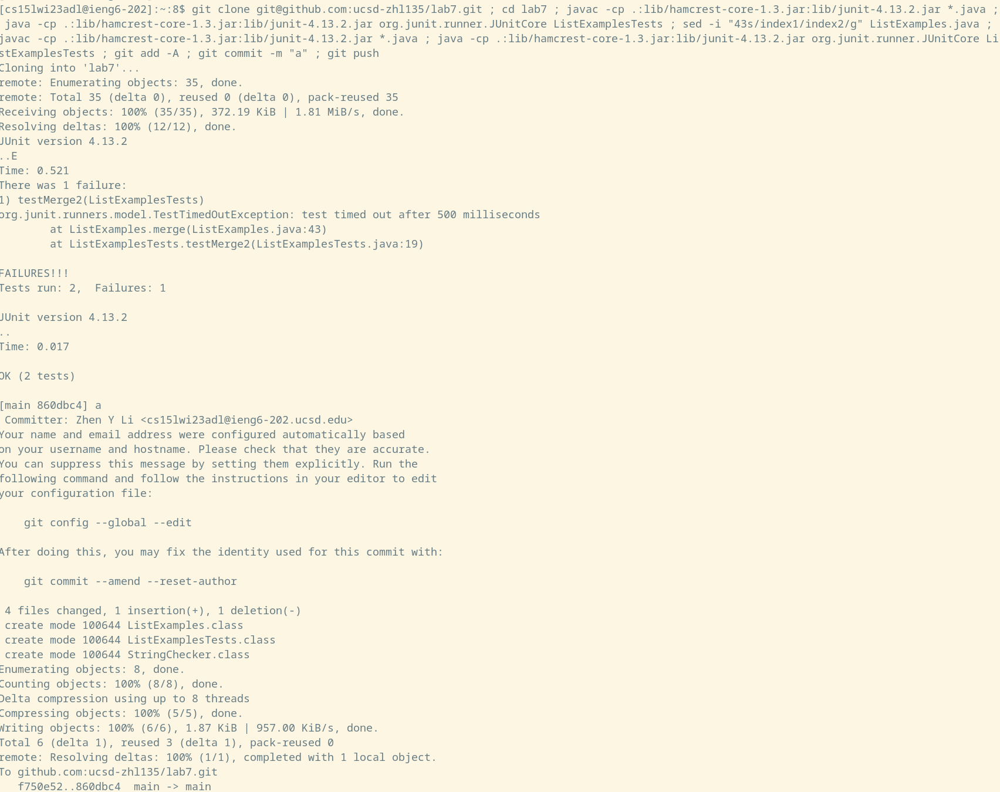

## Lab Report 4

For the competition, I used the strategy of combining all the steps 5-9 into one command with semicolons, which I stored in the bash history on `ieng6`, and could access quickly.

The commands needed were
```
git clone git@github.com:ucsd-zhl135/lab7.git
cd lab7
javac -cp .:lib/hamcrest-core-1.3.jar:lib/junit-4.13.2.jar *.java
java -cp .:lib/hamcrest-core-1.3.jar:lib/junit-4.13.2.jar org.junit.runner.JUnitCore TestListExamples
sed -i "43s/index1/index2/g" ListExamples.java
javac -cp .:lib/hamcrest-core-1.3.jar:lib/junit-4.13.2.jar *.java
java -cp .:lib/hamcrest-core-1.3.jar:lib/junit-4.13.2.jar org.junit.runner.JUnitCore TestListExamples
git add -A && git commit -m "a" && git push
```

The first command cloned my lab7 fork, and then I changed directory into it. Then, I compiled all the java files in the folder, and ran the tests, showing that there was an error. Next, I used the `sed` command to do find and replace in `ListExamples.java`, replacing the occurence of "index1" with "index2" on line 43. This fixed the bug, and the next two command recompiled and reran the tests, showing that they now passed. Finally, I added all the files in the repository with `git add`, and committed and pushed my changes to my github account with `git commit` and `git add`. 

So I combined them into the following:
```
git clone git@github.com:ucsd-zhl135/lab7.git ; cd lab7 ; javac -cp .:lib/hamcrest-core-1.3.jar:lib/junit-4.13.2.jar *.java ; java -cp .:lib/hamcrest-core-1.3.jar:lib/junit-4.13.2.jar org.junit.runner.JUnitCore TestListExamples ; sed -i "43s/index1/index2/g" ListExamples.java ; javac -cp .:lib/hamcrest-core-1.3.jar:lib/junit-4.13.2.jar *.java ; java -cp .:lib/hamcrest-core-1.3.jar:lib/junit-4.13.2.jar org.junit.runner.JUnitCore TestListExamples ; git add -A ; git commit -m "a" ; git push
```

And I also stored the ssh command for step 4 in the bash history of my local machine. So in summary:

# Step 4: 
Keys pressed: `<up><enter>`

This ran the command `ssh cs15lwi23adl@ieng6.ucsd.edu`, which automatically logged me into my ieng6 account as I had ssh keys set up.



# Step 5-7:

Keys pressed: `<up><up><up><enter>`

This ran the command `git clone git@github.com:ucsd-zhl135/lab7.git ; cd lab7 ; javac -cp .:lib/hamcrest-core-1.3.jar:lib/junit-4.13.2.jar *.java ; java -cp .:lib/hamcrest-core-1.3.jar:lib/junit-4.13.2.jar org.junit.runner.JUnitCore TestListExamples ; sed -i "43s/index1/index2/g" ListExamples.java ; javac -cp .:lib/hamcrest-core-1.3.jar:lib/junit-4.13.2.jar *.java ; java -cp .:lib/hamcrest-core-1.3.jar:lib/junit-4.13.2.jar org.junit.runner.JUnitCore TestListExamples ; git add -A ; git commit -m "a" ; git push`, which completed all the steps as detailed above. 

You might wonder why I needed three `<up>`s to reach the command. This is because I directly edited `.bash_history`, but the commands I used to edit the file were added to the `.bash_history` after I replaced it with the big command. So I ended up having to go past `exit` and `vim .bash_history` to reach the command.

Here is a screenshot I ran now:



Note that the test name is different, as someone changed the file name in the original `lab7` repository for some reason.


