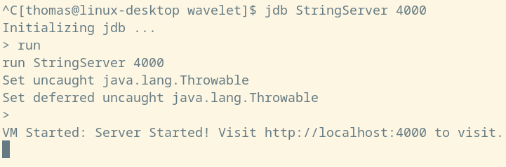
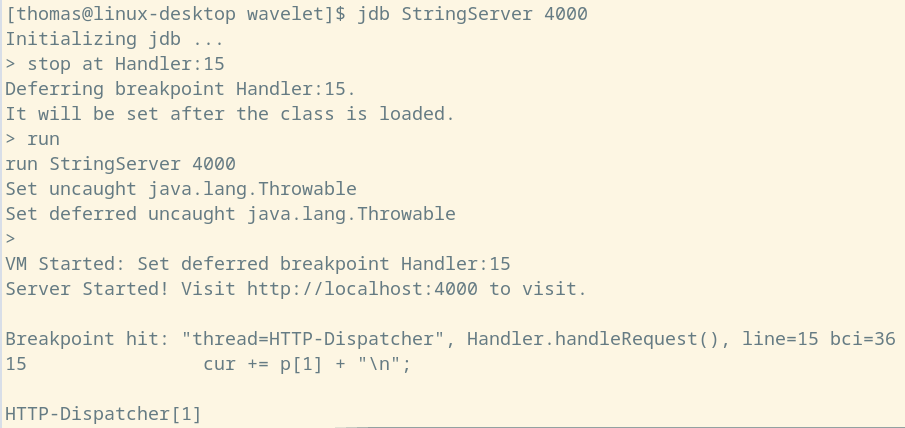
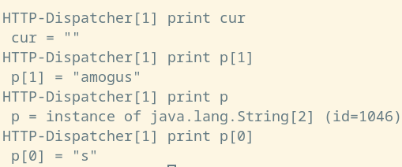
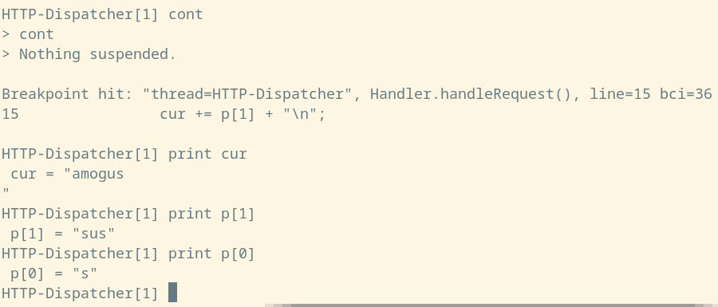
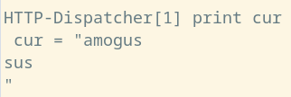

## Lab Report 5

I did the first option -- exploring lab report 2 with JDB. The code for my `StringServer.java` is:
```java
import java.io.IOException;
import java.net.URI;

class Handler implements URLHandler {
    String cur;
    Handler(){
        cur = new String();
    }
    public String handleRequest(URI url) {
        if (url.getPath().equals("/add-message")) {
            String[] p = url.getQuery().split("=");  
            if(!p[0].equals("s")){
                return "Invalid Query";
            }
            `
            return cur;
        } else {
            return "404 Not Found!";
        }
    }
}

class StringServer {
    public static void main(String[] args) throws IOException {
        if(args.length == 0){
            System.out.println("Missing port number! Try any number between 1024 to 49151");
            return;
        }

        int port = Integer.parseInt(args[0]);

        Server.start(port, new Handler());
    }
}

```
We can compile with debug information with `javac -g Server.java StringServer.java`. Since we need to pass in a command line argument for the port, we need to run jdb with the argument: `jdb StringServer 4000` for example. 

Here is a screenshot of running the server with jdb. 


And we can query, for example: 


We can set a breakpoint in StringServer to see its internal behaviour. The class is called `Handler`, so we could do run `stop at Handler:15` to stop at the line with `cur += p[1] + "\n";`. 

Doing just that, we hit the breakpoint when we curl as before. So, we can conclude that line 15, which is in the `handleRequest` method, was reached by the query. 

 

We can print out the values of the relevant values before line 15 is executed:

 

As expected, the query value is "amogus", and the query name is "s", and `cur` is an empty string, since we didn't add anything to it yet. 

After stepping with `step`, we can print `cur` again and see that it contains "amogus\n" now (in the terminal, this is shown as the end quote being on the next line to amogus). Then, we can resume the server with the `cont` command. 

Now, we can do another query. For example, `curl http://localhost:4000/add-message?s=sus`, which should add "sus" to the current string. 

After running that command, we once again hit the breakpoint at line 15, and can print out all of the relevant variables:

 

As expected, cur is "amogus\n", since we didn't add the current value to it yet. And the query value is "sus", query name is "s". After stepping, cur becomes "amogus\nsus\n" as expected.

 

So, using JDB, we found that the StringServer is working as expected. 
